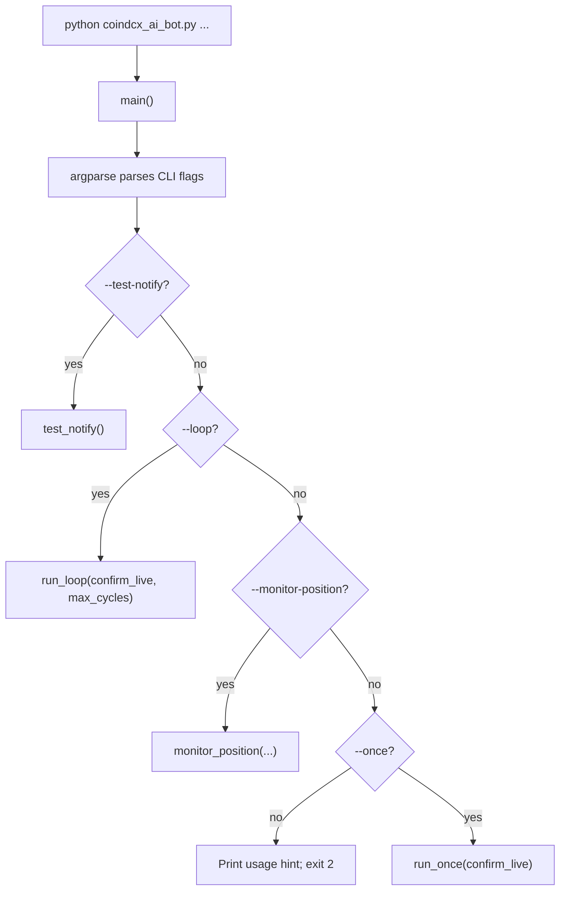
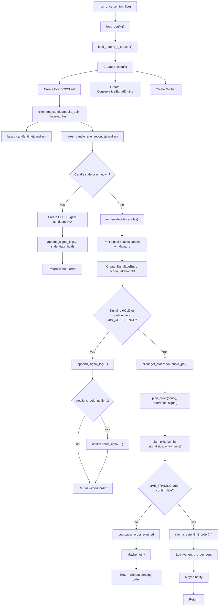
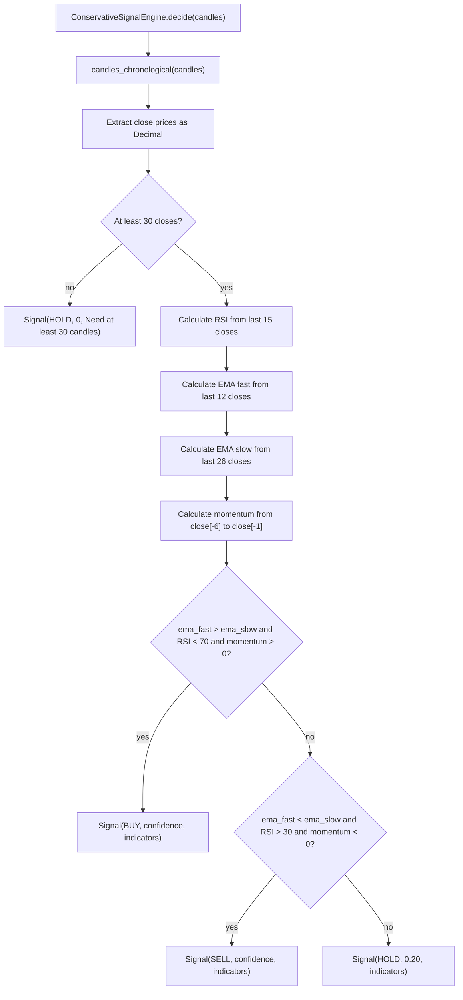
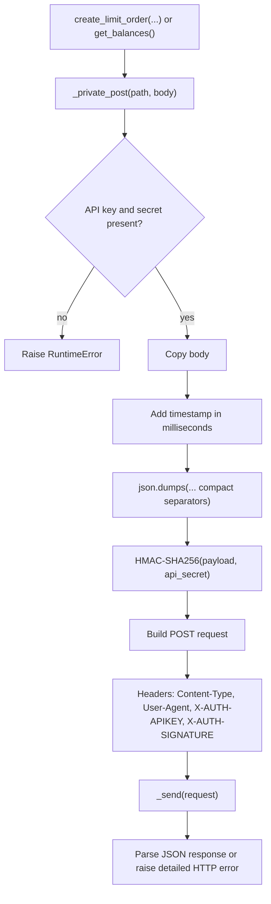
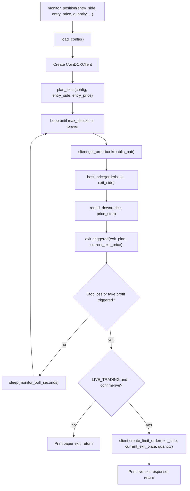
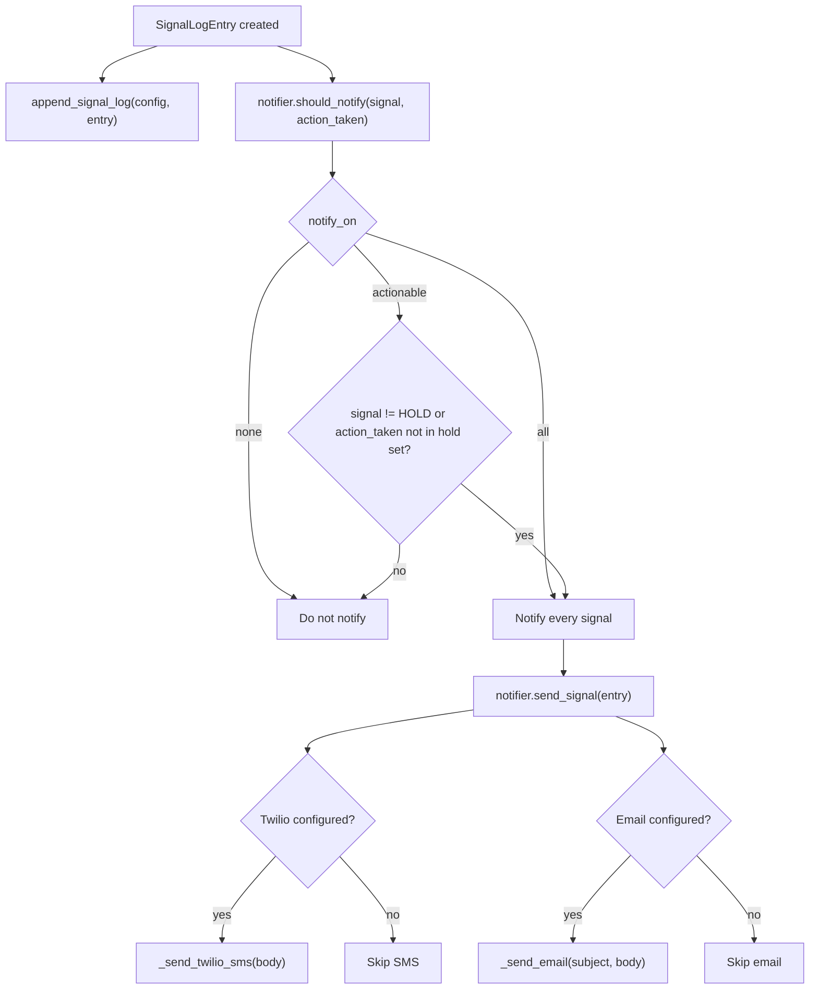

# CoinDCX Bot Code Flow

This file maps the control flow in `coindcx_ai_bot.py`.

## Top-Level CLI Flow

## One-Cycle Signal Flow

## Signal Engine Logic

## Private API Signing Flow

## Monitor Position Flow

## Notification Flow

